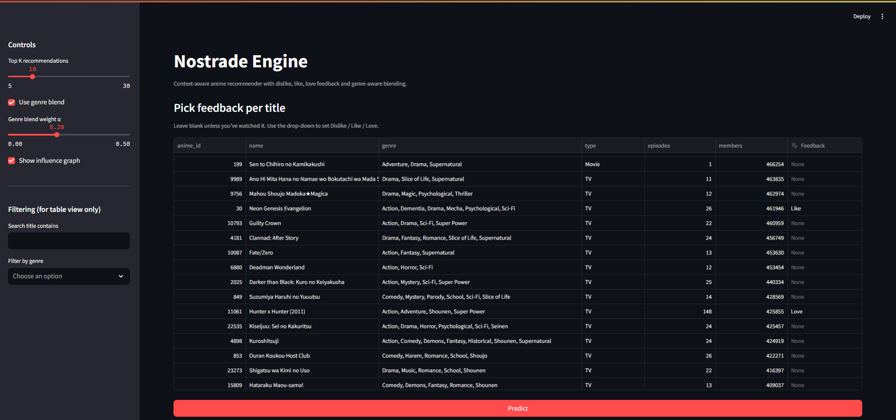
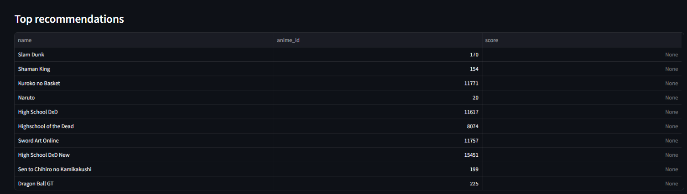

# Nostrade Engine - Context-Aware Anime Recommender
[](https://www.python.org/)
[](https://pytorch.org/)
[](https://streamlit.io/)
[](LICENSE)

A sequence-based recommender that learns from **watch history** and **explicit feedback** (Dislike / Like / Love), with optional **genre-aware blending** and **simple explanations** in a Streamlit demo.

> Built with SASRec (Transformer) + feedback embeddings + optional genre blend for cold start.

---

## ✨ Features

- **Sequential modeling (SASRec)** - predicts your next anime from recent history.
- **Feedback strength** - 3-level feedback (Dislike / Like / Love) improves ranking.
- **Genre-aware blend (optional)** - small lift, especially for short histories.
- **Explainability** - shows which of your past picks most influenced each recommendation.
- **Interactive demo** - scrollable catalog, per-title feedback drop-down, top-K predictions.

---

## 📸 Screenshots (to add)

> placeholders

- `docs/screenshot_app_main.png` - Main page: table with feedback drop-down, Predict button.
- `docs/screenshot_recs.png` - Top-K recommendations table.
- `docs/screenshot_why.png` - “Why these?” table + influence graph.

```text



```

---

## 🧠 Model Overview

- **Backbone:** SASRec (Transformer Encoder, 2–3 layers, d_model≈256)
- **Token at step _t_:** `E_item[i_t] + E_feedback[f_t] + E_pos[t]`
  - Feedback embedding indexes: `0=PAD, 1=Dislike, 2=Like, 3=Love`
- **Loss:** sampled BCE (1 positive, K negatives)
- **Cold start (optional):** genre multi-hot cosine **blend** at inference:
  ```
  final_score = 0.8 * sasrec_score + 0.2 * genre_cosine
  ```
  (`α` is tunable in the UI)

---

## 🧪 Key Results (from `02_eval_ablation.ipynb`)

> Numbers are illustrative-replace with your actual results.

| Model                     | Recall@20 | NDCG@20 |
|--------------------------:|:---------:|:-------:|
| Popularity (baseline)     |   0.012   |  0.006  |
| SASRec (masked feedback)  |   0.041   |  0.028  |
| **SASRec (feedback)**     | **0.047** | **0.031** |
| SASRec + Genre Blend (α=.2)| **0.049** | **0.032** |

**Takeaways:** feedback helps; genre blend adds a small but consistent lift (bigger for short histories).

---

## 🗂️ Repository Layout

```text
.
├─ code/
│  ├─ app.py             # Streamlit UI (drop-down feedback + Predict)
│  └─ predict.py         # Backend: load model, score, explanations
├─ data/
│  ├─ anime.csv          # raw metadata
│  ├─ rating.csv         # raw user ratings
│  └─ processed/
│     ├─ items.parquet           # cleaned items (aligned to iid_map)
│     └─ interactions.parquet    # uid, iid, feedback, timestamp
├─ checkpoints/
│  └─ sasrec_final.pt    # trained SASRec weights
├─ artifacts/
│  └─ iid_map.json       # anime_id → iid (exact mapping used in training)
├─ notebooks/
│  ├─ 01_sasrec_feedback_demo.ipynb
│  └─ 02_eval_ablation.ipynb
└─ make_processed_data.py # quick script to rebuild /processed
```

---

## ⚙️ Setup

```bash
# create env (example)
conda create -n nostrade python=3.11 -y
conda activate nostrade

# install deps
pip install torch torchvision --index-url https://download.pytorch.org/whl/cu121
pip install streamlit pandas numpy pyarrow scikit-learn tqdm matplotlib networkx
```

---

## 🏗️ Data Processing (once)

If you don’t have `data/processed/items.parquet` yet, run:

```bash
python make_processed_data.py
```

This script:
- buckets ratings → feedback (0/1/2),
- builds contiguous `uid`/`iid`,
- saves `items.parquet` and `interactions.parquet`.

> Ensure `artifacts/iid_map.json` exists and matches your training run. If not, regenerate it from the training notebook and save it:

```
with open("artifacts/iid_map.json","w") as f:
    json.dump({int(k): int(v) for k,v in iid_map.items()}, f)
```

---

## ▶️ Run the App

```bash
streamlit run code/app.py
```

- Use the catalogue drop-down to set **Dislike / Like / Love** for a handful of shows you know.
- Click **Predict** to get Top-K.
- Toggle **genre blend** in the sidebar.
- See **Why these?** for explanations, and **Influence graph** for a quick visualization.

---

## 🧩 How Explanations Work

For each recommendation, we find the **most similar** item among your picks using **cosine similarity** in the learned **item embedding** space. We show:
- `Recommended` title,
- `Most similar from your picks`,
- similarity score (rounded).

The graph draws a directed edge from your pick → recommendation, weighted by similarity.

---

## 🛟 Troubleshooting

**1) `FileNotFoundError: data/processed/items.parquet`**  
You haven’t created processed files yet. Run:
```bash
python make_processed_data.py
```

**2) `RuntimeError ... size mismatch for item_emb.weight/out_bias`**  
Your checkpoint index count doesn’t match the current items. Fix by aligning metadata to the **exact training mapping** (`artifacts/iid_map.json`). `predict.py` already:
- loads `iid_map.json`,
- **reorders**/filters `items.parquet` to the same iid order.

**3) `Missing key(s) layernorm vs norm` when loading state_dict**  
Your checkpoint used a different attribute name for LayerNorm. `predict.py` remaps `layernorm.* ↔ norm.*` automatically before loading (or rename the attribute in your class).

**4) I don’t want to scroll 12k rows**  
The UI shows the **top 500 by popularity** (members) by default; use the **search field** and **genre filter** to narrow quickly.

---

## 🔬 Reproduce Results

- **Notebook 1:** `01_sasrec_feedback_demo.ipynb`  
  End-to-end training (data → sequences → SASRec → quick eval).

- **Notebook 2:** `02_eval_ablation.ipynb`  
  PopRec vs SASRec (with/without feedback) vs SASRec+Genre; tables + plots.

---

## 🧭 Roadmap (nice-to-haves)

- Save UI selections to `events.parquet` (one click) for future fine-tuning.
- Add a search-to-add widget (type a title, add it to a small “Your picks” panel).
- Add **alpha sweep** (0.1 / 0.2 / 0.3) chart for genre blend robustness.
- Cache posters (if available) and show thumbnails in the table.
- Export “Top-K with explanations” to CSV for sharing.

---

## 📄 License

MIT

---

## 🙌 Acknowledgements

- Dataset: [Anime Recommendations Database](https://www.kaggle.com/datasets/CooperUnion/anime-recommendations-database) (Kaggle, CooperUnion).
- SASRec: *Self-Attentive Sequential Recommendation* (Kang & McAuley, 2018).
- Thanks to the open-source PyTorch & Streamlit communities.

